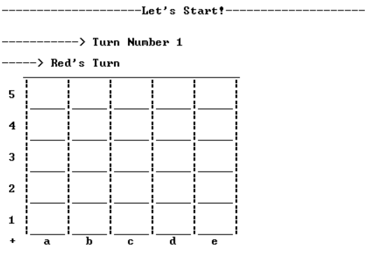
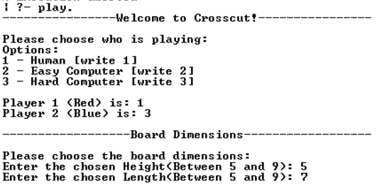

# CrossCut
Primeiro projeto realizado no âmbito da disciplina de PFL.
 
### Desenvolvido pelo Grupo Crosscut_1 da Turma 01
- Isabel Maria Lima Moutinho (up202108767) - 50%
- Tiago Ribeiro de Sá Cruz (up202108810) - 50%

## Correr o Código
- Instalação de SICStus Prolog 4.8
- Consultar o código em src/proj.pl
- Executar o comando ```play.```

## Descrição do Jogo

O crosscut, desenvolvido por [Mark Steere](https://www.marksteeregames.com/) joga-se num tabuleiro retangular, pelo menos 5x5 e menos de 10x10. Os dois jogadores azul e vermelho jogam à vez colocando discos no tabuleiro, um disco por turno, começando com o vermelho. É obrigatório jogar. Se não houverem jogadas válidas disponíveis, o seu turno é passado à frente. <br>
O objetivo do jogo é formar um segmento (horizontal ou vertical) de um lado ao outro, sem contar com as bordas. <br>
Um jogador poderá colocar uma peça em todos os locais do tabuleiro, menos nas bordas, a não ser que consiga fazer um 'flip'. Um 'flip' consiste em, quando um jogador coloca as suas peças nos cantos de peças do adversário, então as peças do adversário tornam-se suas, a não ser que, o segmento flanqueado do adversário seja maior ou igual ao novo segmento do jogador. Caso este 'flip' legal seja atingido, um jogador poderá colocar a sua peça na borda temporariamente, de modo a fazer o 'flip', mas de seguida essa mesma peça será retirada.

[Regras Oficiais](http://marksteeregames.com/Crosscut_rules.pdf)

## Lógica do Jogo


### Representação interna do Game State
A informação guardada relevante ao estado do jogo é a seguinte:
- Turno em que o jogo se encontra, começa em 1 e aumenta sempre que é realizada uma jogada válida.
- Dois valores, entre 1 e 3, referentes ao tipo de jogador, um para Red, outro para Blue.
  - 1 - pessoa.
  - 2 - computador fácil.
  - 3 - computador difícil.
- Board do jogo.
- Altura da Board.
- Largura da Board.
  
  
#### Board
A board é representada como uma lista de listas, em que cada lista corresponde a uma linha desta. 
O elemento duma lista pode ter o valor de x, 'B' e 'R', sendo que x corresponde a uma célula da Board desocupada, 
e as strings 'B' e 'R' à presença de uma peça do jogador Blue ou Red respetivamente.  
  
No estado inicial a representação interna da Board está preenchida com x,
que são modificados para a string indicativa da peça de um jogador, 'B' ou 'R',
quando este faz uma jogada.

```
Estado Inicial:      Possível estado intermédio:    Possivel estado final:
[ [x,x,x,x,x,x],     [ [x, x , x , x , x ,x],       [ [x, x , x , x , x ,x],
  [x,x,x,x,x,x],       [x,'B', x , x , x ,x],         [x,'B', x , x , x ,x],
  [x,x,x,x,x,x],       [x,'R', x ,'R','B',x],         [x,'R','R','R','R',x],
  [x,x,x,x,x,x],       [x,'R', x , x , x ,x],         [x,'R', x , x , x ,x],
  [x,x,x,x,x,x] ]      [x, x , x , x , x ,x] ]        [x, x , x , x , x ,x] ]
```

### Visualização do Jogo
Após estarem definidos os valores necessários para começar o jogo (ver Menus),
o predicado display_game(+GameState) vai tratar de o apresentar:  


#### Implementação:
O predicado, numa primeira fase apresenta o turno do jogo e a que jogador esse turno corresponde, 
ambos derivados do turno guardado no game state (se o turno for ímpar, é o turno do jogador Red,
se for par é do Blue, já que a primeira jogada é sempre do Red).
De seguida apresenta a Board atual 'desenhando-a' começando pela sua primeira linha até à última, recursivamente.  
  
> É de notar que o primeiro índex da Board interna corresponde ao último índex da Board apresentada ao jogador, 
já que esta contem coordenadas verticais decrescentes. Esta particularidade é de extrema importância para a 
compreensão de certas linhas de código.

#### Menus
Aquando o início do programa, é apresentada uma série de menus, de forma a obter as dimensões da Board e tipos de jogadores:  


### Validação e Execução das jogadas

#### Move
Durante o jogo há uma série de jogadas que são ilegais e que devem ser prevenidas, nomeadamente colocações de peças 
fora das dimensões da Board e nas linhas/colunas que a delimitam. Há também consequências que devem ser aplicadas
após certas jogadas.  
O predicado move(+GameState, +Move, -NewGameState), decomposto em make_move e validade_move, trata deste processo:  
  
#### Make Move
Após um jogador, humano ou computador, introduzir a jogada que quer realizar, o predicado make_move vai construir uma Board nova,
baseada na existente, mas com a posição da jogada alterada, no entanto este irá falhar se:  
- Na posição já se encontrar um valor que não x.
- A coordenada da posição exceder as dimensões da Board.  
  
#### Validate Move
Sucesso no predicado make_move não é, contudo condição suficiente para o move ser possível, 
já que este permite a colocação nas bordas da Board, assim a Board resultante deste predicado deve ser
passada a validate_move para validações referentes a 'flips' e execução destes.  
  
O predicado validate_move vai, a partir da posição da jogada, atentar um 'flip' vertical ou horizontal, este processo
passa por:
1. Verificar se está no contexto de um 'flip' (flanked) - se a posição da jogada é adjacente a um segmento inimigo, 
e se existe uma peça amiga no fim desse segmento.
2. Executar o flip.
3. Verificar se não ocorreu um 'flip' proibido* - obtém o comprimento do segmento que o 'flip' gerou e compara-o o
comprimento de todos os segmentos inimigos cortados por ele.  
\*Ocorre quando o segmento amigo criado é menor ou igual a um qualquer segmento inimigo que seja cortado pelo flip.
  
> Se o passo 1. avaliar para falso, a peça é colocada caso não esteja nas bordas da Board.
No passo 3. a peça é sempre colocada, mas se este falhar não haverá 'flip'.

**Múltiplos 'flips' numa jogada:** No caso de haver dois 'flips' na mesma direção, é verificado o segmento que ambos
os flips causariam e, caso esse seja proibido, os 'flips' são verificados individualmente.

### Lista de jogadas válidas
De modo a colecionar numa lista todas as jogadas possíveis, o predicado valid_moves(+GameState, +Player, -ListOfMoves) 
percorre cada coordenada da Board e simula a jogada, pelo jogador, nessa posição, com recurso a
[make_move](#make-move) e [validate_move](#validate-move), adicionando-a ao conjunto 
de jogadas validas se não for negada.

### Fim de Jogo
Após a execução de uma jogada, é verificado pelo predicado game_over(+State, -Winner) se a peça colocada
provocou o fim do jogo, ou seja se um dos jogadores tem agora um segmento vertical de tamanho maior, ou 
igual à altura da Board menos dois, ou um segmento horizontal de tamanho maior, ou igual à largura da Board menos dois.  
Para isto a condição referida é verificada pelo predicado em cada linha e coluna uma vez.

### Avaliação do estado do jogo
De forma a avaliar o estado do jogo num certo momento, e sendo que o que distingue esses
momentos são não só a Board como a jogada realizada, o predicado value(+GameState, +move, +Player, -Value) baseia-se numa 
move(Number, Letter), e altera o valor do Value consoante a vantagem ou desvantagem 
que o jogador obteve ao realizar essa jogada.
  
O valor do estado do jogo corresponderá ao seguinte:
- -100, caso a jogada garanta a vitória ao jogador que a efetuou.


-  100, caso a jogada garanta ao adversário a possibilidade de dar 'flip' a um segmento do jogador, possivelmente levando à derrota imediata do jogador, se o segmento for grande o suficiente.


- Por defeito, se a jogada não resultar em nenhuma consequência, positiva ou negativa, será o mínimo entre:
  - Diferença do tamanho da coluna(exceto bordas) da jogada com o tamanho do segmento do jogador nessa coluna, adicionada ao tamanho do segmento adversário nessa coluna.
  - Diferença do tamanho da linha(exceto bordas) da jogada com o tamanho do segmento do jogador nessa linha, adicionada ao tamanho do segmento adversário nessa linha.


- Caso a jogada forme um segmento maior, com um avanço de dois, que qualquer segmento inimigo adjacente, ou seja que não possa ser cortado, será o mínimo entre:
  - Diferença do tamanho da coluna(exceto bordas) da jogada com o tamanho do segmento do jogador nessa coluna.
  - Diferença do tamanho da linha(exceto bordas) da jogada com o tamanho do segmento do jogador nessa linha.


- Caso a jogada bloqueie o progresso de um segmento adversário, será a diferença entre:
  - Diferença do tamanho da coluna(exceto bordas) da jogada com o tamanho dos segmentos inimigos bloqueados nessa coluna.
  - Diferença do tamanho da linha(exceto bordas) da jogada com o tamanho dos segmentos inimigos bloqueados nessa linha.  

  Um bloqueio considera-se como o posicionamento a um espaço de distância do canto de um segmento, bloqueios mais distantes não são valorizados.


>Como se vê refletido nos valores apresentados acima, interpreta-se o valor do estado do jogo como melhor o quão menor for.

### Jogadas do Computador
Consoante o nível de dificuldade do computador, o predicado choose_move obtém uma lista de todas as jogadas válidas, através do predicado [valid_moves](#lista-de-jogadas-válidas) e de seguida:
- Caso esteja no nível 1, seleciona da lista de jogadas, uma jogada aleatória.
- Caso esteja no nível 2, usa o predicado get_best_moves para a partir da lista de jogadas possíveis obter as de melhor valor, ou seja, que no momento da jogada se traduzam no melhor [estado do jogo](#avaliação-do-estado-do-jogo).  
  get_best_moves aproveita-se do predicado [move](#move) para determinar que jogadas têm melhores consequências.


## Conclusões
Ao longo deste projeto tivemos a oportunidade de consolidar diversos conceitos relevantes, devido por exemplo, à qualidade recursiva da linguagem e proximidade ao raciocínio lógico.  
Simultaneamente, a maior dificuldade encontrada, principalmente nas fazes inicias do desenvolvimento do projeto, foi sem dúvida a disparidade entre a linguagem de programação
utilizada e as demais linguagens estudadas. 

#### Possíveis Melhorias
A apresentação do código e predicados ainda pode ser simplificada e melhor organizada do que o que foi possível.  
O modo difícil do computador, apesar de considerarmos já abranger várias estratégias, poderia ser melhorado com adicional 
exploração das mecânicas do jogo.

## Bibliografia

- GitHub Co-Pilot
- Professor Gonçalo Leão
- https://www.swi-prolog.org/
- https://sicstus.sics.se/documentation.html
